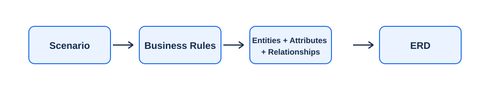
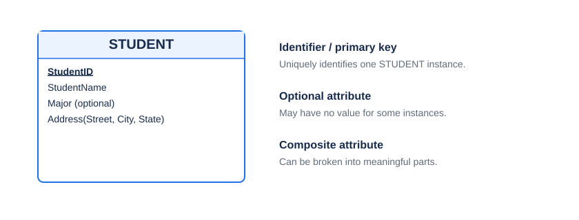
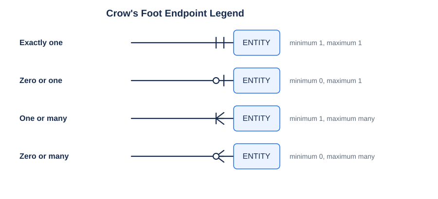
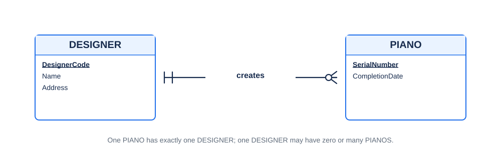
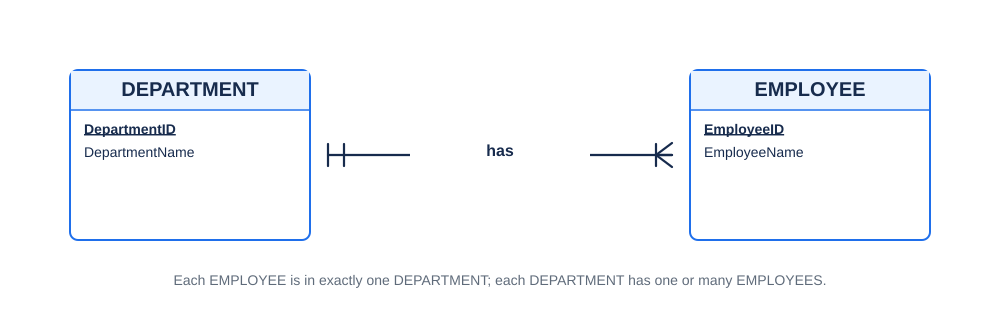
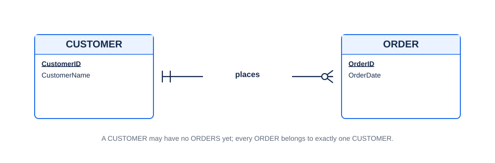
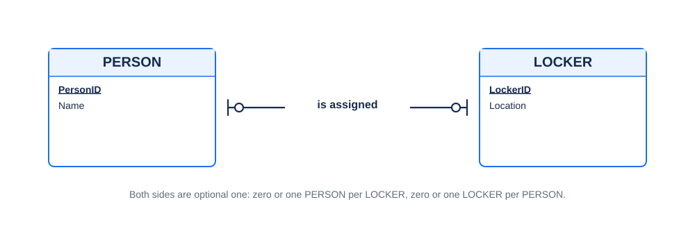
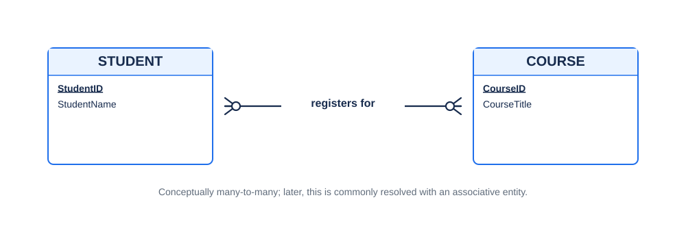

# ERD Basics + Crow's Foot Notation

> **Student study sheet — ISYS 464, Chapter 2**  
> Clear rules, readable diagrams, and short worked examples.



The basic workflow in the chapter is:

**Scenario → Business Rules → Entities + Attributes + Relationships → ERD**

The first part of Chapter 2 introduces entities, attributes, and identifiers; the later relationship slides develop cardinality and Crow's Foot notation in more detail.

---

## 1. ERD in one minute

An **Entity-Relationship Diagram (ERD)** is a visual model of the data an organization wants to keep.

| ERD part | Meaning | Example |
|---|---|---|
| **Entity** | A person, place, object, event, or concept we store data about | `STUDENT`, `COURSE`, `ORDER` |
| **Attribute** | A property or characteristic | `StudentName`, `OrderDate` |
| **Identifier** | Attribute(s) that uniquely identify one entity instance | `StudentID`, `ISBN` |
| **Relationship** | A connection between entities | CUSTOMER **places** ORDER |

> [!TIP]
> A useful first question is: **What things does the organization need to remember?** Those things are candidates for entities.

---

## 2. Entities: what belongs in an ERD?

The chapter defines an **entity** as a person, place, object, event, or concept about which the organization wants to maintain data.

Good entity names are:

- **singular nouns**
- concise
- specific to the organization
- consistent across diagrams

Examples: `EMPLOYEE`, `STORE`, `COURSE`, `ORDER`.

An entity should normally have **many possible instances** and **multiple attributes**.

### Do not automatically turn every noun into an entity

The slides warn against modeling:

- a **user of the database system** merely because that person uses the system
- an **output of the system**, such as a report

The question is not "is this noun in the story?" The question is **"do we need to store data about instances of this thing?"**

---

## 3. Attributes and identifiers



An **attribute** is a property or characteristic of an entity or relationship.

### Attribute types used in Chapter 2

| Type | Meaning | Example / slide syntax |
|---|---|---|
| **Required** | Must have a value for every instance | `StudentName` |
| **Optional** | May have no value for some instances | `Major` |
| **Simple** | Not meaningfully divided further for the model | `Price` |
| **Composite** | Has meaningful component parts | `Address(Street, City, State, PostalCode)` |
| **Multivalued** | May have more than one value for one instance | `{Skill}` |
| **Derived** | Calculated from other data | `[YearsEmployed]` |
| **Identifier / Primary Key** | Uniquely identifies an instance | `StudentID` |

> [!IMPORTANT]
> The **curly braces `{ }` above are the chapter's syntax for a multivalued attribute**. They are **not** being used as a text substitute for a Crow's Foot.

### Good identifiers

The slides recommend choosing identifiers that:

- will **not change** in value
- will **not be null**
- uniquely identify one entity instance

The slides display the identifier **bold and underlined** in the entity box.

---

## 4. Business rules come before the drawing

A **business rule** states what is allowed or required in the scenario.

For a binary relationship, write **one rule in each direction**.

Example:

1. Each **DESIGNER may create many PIANOS**.
2. Each **PIANO must be created by exactly one DESIGNER**.

Useful wording from the chapter:

| Wording | What it tells you |
|---|---|
| **may / can / optional** | minimum can be **0** |
| **must / have to** | minimum is **1 or more** |
| **exactly one / only one** | maximum is **1** |
| **many / several** | maximum is **many** |
| **at least one / one or more** | minimum **1**, maximum **many** |

> [!TIP]
> Do **not** draw the symbols first. Write the two business rules first; the symbols become much easier.

---

# 5. Crow's Foot notation

Each relationship endpoint answers **two questions**:

1. **Minimum:** can the number be 0, or must it be at least 1?
2. **Maximum:** can there be only 1, or can there be many?



### What the symbols mean

- **empty circle** = zero / optional
- **vertical line** = one
- **Crow's Foot** = many

So the four endpoint combinations are:

| Meaning | Minimum | Maximum |
|---|---:|---:|
| **Exactly one** | 1 | 1 |
| **Zero or one** | 0 | 1 |
| **One or many** | 1 | many |
| **Zero or many** | 0 | many |

### Plain-text shorthand for notes

When you cannot draw the real symbol, use `<` and `>` to suggest the Crow's Foot rather than curly braces.

| Meaning | Entity is on the **right** | Entity is on the **left** |
|---|---|---|
| exactly one | `|| ENTITY` | `ENTITY ||` |
| zero or one | `o| ENTITY` | `ENTITY |o` |
| one or many | `|< ENTITY` | `ENTITY >|` |
| zero or many | `o< ENTITY` | `ENTITY >o` |

These angle brackets are only a **plain-text approximation**. In an actual ERD, draw the real three-pronged Crow's Foot.

---

## 6. The rule students most often mix up

The symbols next to an entity tell you **how many of that entity** can be related to **one instance on the other side**.

Suppose the rule says:

> Each **CUSTOMER may place zero or many ORDERS**.

You are counting **ORDERS per CUSTOMER**, so **zero-or-many goes next to ORDER**.

Then the reverse rule says:

> Each **ORDER must be placed by exactly one CUSTOMER**.

You are counting **CUSTOMERS per ORDER**, so **exactly-one goes next to CUSTOMER**.

Plain text:

```text
CUSTOMER || ---------------- o< ORDER
```

That one habit prevents a lot of cardinality mistakes.

---

# 7. Worked examples

## Example 1 — DESIGNER and PIANO

### Scenario

Each piano must be created by only one designer. A designer may create multiple pianos, and a designer may exist in the database before creating any piano.

### Business rules

1. Each **DESIGNER may create zero or many PIANOS**.
2. Each **PIANO must be created by exactly one DESIGNER**.



Plain-text check:

```text
DESIGNER || ---------------- o< PIANO
```

**Relationship type:** one-to-many (`1:M`).

---

## Example 2 — DEPARTMENT and EMPLOYEE

### Scenario

Every employee must work in exactly one department. Every department must have at least one employee.

### Business rules

1. Each **EMPLOYEE must work in exactly one DEPARTMENT**.
2. Each **DEPARTMENT must have one or many EMPLOYEES**.



Plain-text check:

```text
DEPARTMENT || --------------- |< EMPLOYEE
```

**Relationship type:** one-to-many (`1:M`).

Notice the difference from the CUSTOMER–ORDER example: here, a department is **not allowed to have zero employees**.

---

## Example 3 — CUSTOMER and ORDER

### Scenario

A customer may place many orders, but a customer does not have to place an order yet. Every order must belong to exactly one customer.

### Business rules

1. Each **CUSTOMER may place zero or many ORDERS**.
2. Each **ORDER must be placed by exactly one CUSTOMER**.



```text
CUSTOMER || ---------------- o< ORDER
```

Again, this is `1:M`, but the **minimum** on the ORDER side is different from Example 2.

---

## Example 4 — PERSON and LOCKER

### Scenario

A person may be assigned one locker, but not everyone has one. A locker may be assigned to one person, but some lockers are unused.

### Business rules

1. Each **PERSON may have zero or one LOCKER**.
2. Each **LOCKER may be assigned to zero or one PERSON**.



```text
PERSON |o ---------------- o| LOCKER
```

**Relationship type:** optional one-to-one (`1:1`).

---

## Example 5 — STUDENT and COURSE

### Scenario

A student may register for many courses, and a course may have many students.

### Business rules

1. Each **STUDENT may register for zero or many COURSES**.
2. Each **COURSE may have zero or many STUDENTS**.



```text
STUDENT >o ---------------- o< COURSE
```

**Relationship type:** many-to-many (`M:N`).

Later in Chapter 2, the slides explain that a many-to-many relationship is commonly replaced by an **associative entity**, producing two one-to-many relationships.

---

# 8. A repeatable method for solving ERD questions

Use this order every time.

### Step 1 — Identify candidate entities

Look for important nouns that represent things the organization needs to store data about.

```text
A customer places orders.

Possible entities:
CUSTOMER
ORDER
```

### Step 2 — List attributes

```text
CUSTOMER
- CustomerID
- CustomerName

ORDER
- OrderID
- OrderDate
```

### Step 3 — Choose the identifier for each entity

Ask: **What uniquely identifies one instance?**

```text
CustomerID -> CUSTOMER identifier
OrderID    -> ORDER identifier
```

### Step 4 — Find the relationship verb

```text
CUSTOMER places ORDER
```

### Step 5 — Write TWO business rules

```text
Each CUSTOMER may place zero or many ORDERS.
Each ORDER must be placed by exactly one CUSTOMER.
```

### Step 6 — Determine min and max on both ends

```text
ORDERS per CUSTOMER    = 0..many
CUSTOMERS per ORDER    = exactly 1
```

### Step 7 — Draw the endpoints

```text
CUSTOMER || ---------------- o< ORDER
```

### Step 8 — Read the diagram back in English

If you cannot read it back as the original two business rules, re-check the endpoint symbols.

---

# 9. Common mistakes

### Mistake 1 — Looking only for "one-to-many"

`1:M` tells you the **maximums**, but it does not tell you whether participation is optional or mandatory.

These are both one-to-many, but they are not the same:

```text
DEPARTMENT || -------- |< EMPLOYEE
CUSTOMER   || -------- o< ORDER
```

The first requires at least one employee per department. The second allows a customer with no orders.

### Mistake 2 — Putting the symbol beside the entity named first in the sentence

Do not place symbols based on word order. Ask **what you are counting**.

> Each CUSTOMER may place many **ORDERS** → put "many" next to **ORDER**.

### Mistake 3 — Treating optional as the same as "one"

Optional answers the **minimum** question. One/many answers the **maximum** question.

- `0..1` = optional one
- `1..1` = mandatory one
- `0..many` = optional many
- `1..many` = mandatory many

### Mistake 4 — Choosing a poor identifier

A primary key should uniquely identify an instance and should not be null. The slides also recommend an identifier whose value will not change.

### Mistake 5 — Turning a report or system user into an entity

Only model it as an entity if the scenario actually requires storing data about its instances.

---

# 10. Quick practice

Try to write the **two business rules** before checking the answer.

## Practice A

A teacher may teach many classes. Every class must be taught by exactly one teacher.

<details>
<summary><strong>Show answer</strong></summary>

Business rules:

1. Each **TEACHER may teach zero or many CLASSES**.
2. Each **CLASS must be taught by exactly one TEACHER**.

```text
TEACHER || ---------------- o< CLASS
```

</details>

---

## Practice B

Every car must have exactly one engine. Every engine must belong to exactly one car.

<details>
<summary><strong>Show answer</strong></summary>

```text
CAR || ---------------- || ENGINE
```

Mandatory one-to-one.

</details>

---

## Practice C

An employee may work on many projects. Every project must have at least one employee.

<details>
<summary><strong>Show answer</strong></summary>

Business rules:

1. Each **EMPLOYEE may work on zero or many PROJECTS**.
2. Each **PROJECT must have one or many EMPLOYEES**.

```text
EMPLOYEE >| ---------------- o< PROJECT
```

This is many-to-many at the conceptual level, with mandatory-many EMPLOYEES per PROJECT and optional-many PROJECTS per EMPLOYEE.

</details>

---

## Practice D

A library member may have no library card yet or may have exactly one card. Every issued library card must belong to exactly one member.

<details>
<summary><strong>Show answer</strong></summary>

```text
MEMBER || ---------------- o| LIBRARY_CARD
```

Read carefully:

- one MEMBER can have `0..1` LIBRARY_CARD
- one LIBRARY_CARD belongs to exactly `1` MEMBER

</details>

---

# 11. Exam / assignment checklist

Before you submit an ERD, ask:

- [ ] Are my entity names **singular nouns**?
- [ ] Does each entity represent something the organization actually stores data about?
- [ ] Does each entity have an appropriate **identifier**?
- [ ] Did I identify required, optional, composite, multivalued, or derived attributes when relevant?
- [ ] Did I write **two business rules** for every binary relationship?
- [ ] Did I determine both **minimum and maximum cardinality** at each end?
- [ ] Does every relationship end show **optional/mandatory** and **one/many**?
- [ ] Can I read the finished diagram back into the original business rules?

---

# 12. Ultra-short reference

```text
Entity       = thing we store data about
Attribute    = fact/property about it
Identifier   = uniquely identifies one instance
Relationship = connection between entities
```

```text
empty circle = 0 / optional
vertical bar = 1
Crow's Foot  = many
```

```text
0..1     = optional one
1..1     = exactly one
0..many  = optional many
1..many  = mandatory many
```

**Best habit:** write the two business-rule sentences first, then draw the cardinality symbols.

---

## Source alignment

Prepared from the course file **Chapter 2 — Modeling Data: ERD, Entities and Attributes**. The entity/attribute material aligns especially with slides 3–24; the relationship/cardinality and associative-entity reminders align with the later Chapter 2 relationship slides.
